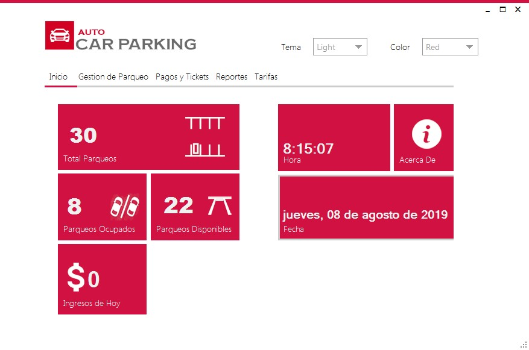
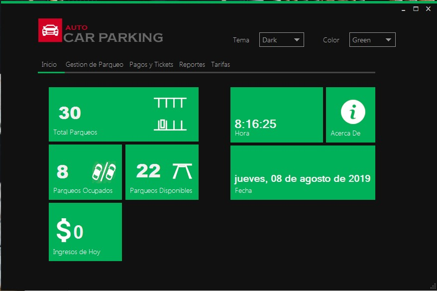
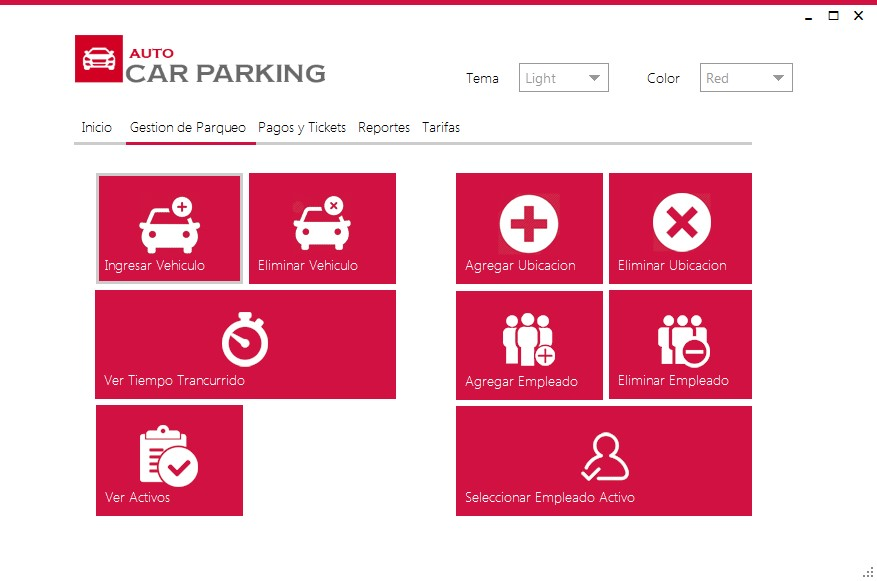
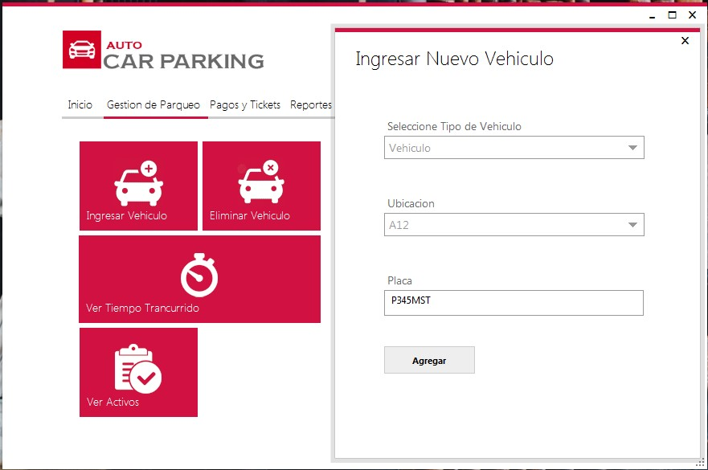
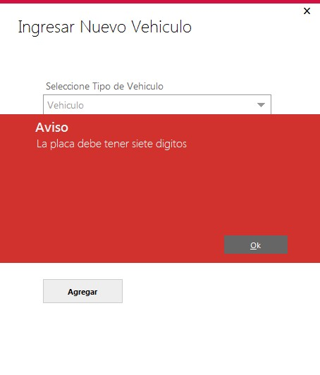
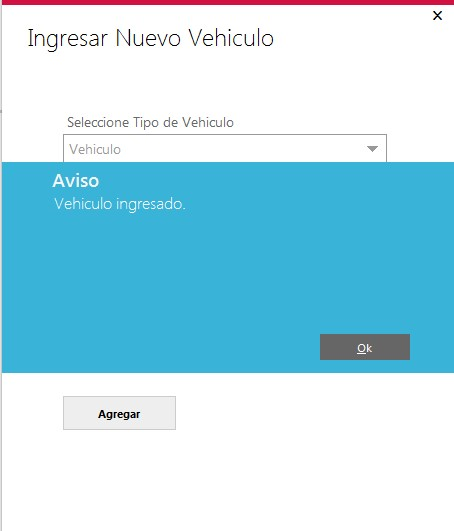
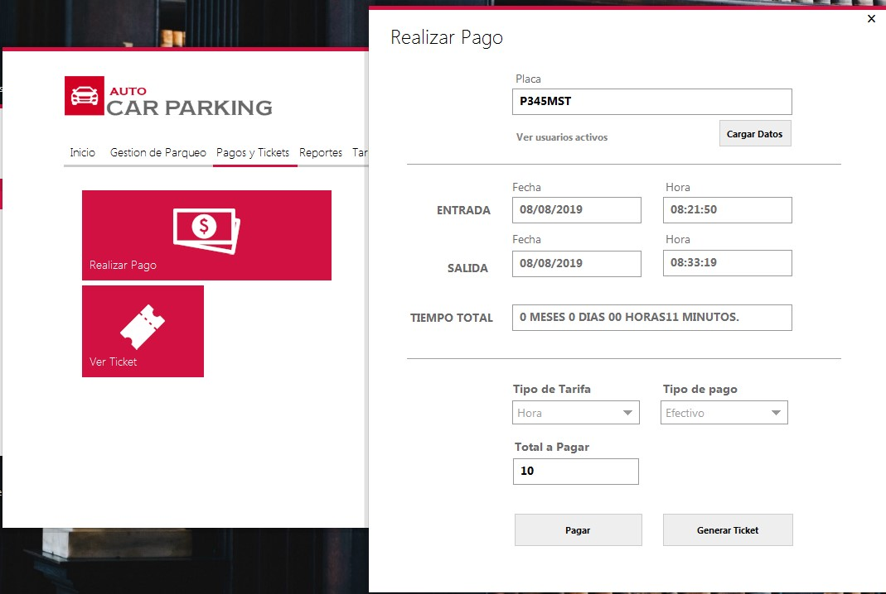

# Proyecto Administración de Parqueo

Programa de escritorio para la administración de un parque. Este proyecto fue hecho como parte del curso programación I.

Herramientas utilizadas:

* Visual Studio 2017
* C#
* Windows Forms
* Metro UI Framework
* SQL Server

## Pantalla de Inicio

Provee información general sobre el programa: Hora, fecha, parqueos disponibles y ocupados e ingresos.

También es posible modificar el tema de la aplicación

## Gestión de Parqueo

Esta sección permite ingresar y eliminar vehículos, así como ver el tiempo transcurrido por un vehículo y ver los vehículos que actualmente están en el parqueo. También otras opciones de administración.

## Ingreso Vehículo

### Validación de placa

## Realizar Pago

Esta sección permite ingresar el número de placa de alguno de los vehículos que se encuentran en el parqueo y despliega las hora de entrada y salida del vehículo así como el tiempo que el vehículo estuvo en el parqueo y el monto a pagar.

## Modificar Tarifas

